# Two-Stage CMOS Op-Amp (LTspice)

This is a small personal project that I worked on to improve my knowledge of transistors and op-amps. I built a two-stage amplifier using an NMOS differential input pair, 
a PMOS current mirror, a common-source NMOS second stage, and a PMOS active load.

This project was an introduction to transistor level design, which really caught my attention. It was very interesting to see how different transistors interacted with each other to amplify a signal.

During the research I did to complete this project, a much recommended step was to do Miller compensation using a Miller capacitor, which I unfortunately failed to do. For some reason, it wasn't working, it just kept decreasing my bandwidth without improving the phase margin, so I gave up on it. It was still a successful project which worked using various input tests, as shown below.

## Starting with the NMOS
I first started with only one NMOS transistor and characterized it using DC sweeps.
I first swept the gate voltage from 0 V to 5 V. The transistor starts conducting around the threshold voltage of 0.7 V, and the drain current reaches about 20.2 mA at the end of the sweep.
I also swept the drain voltage for different gate voltages to see the output characteristics of the NMOS. The highest curve reached around 20.3 mA at VDS = 5 V, and the curves made it much easier to see the transition between the different operating regions of the transistor.

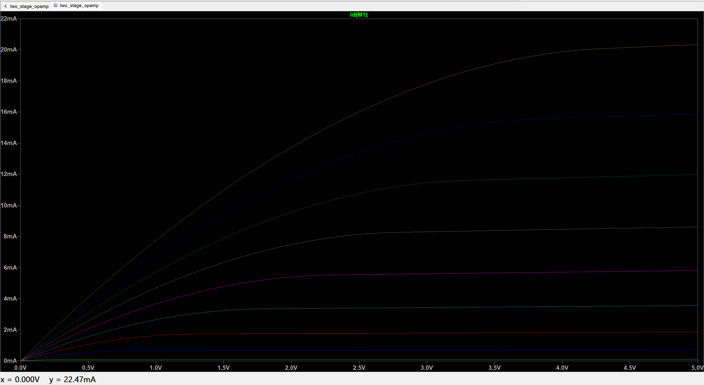

## Adding the second NMOS
Then I added the second NMOS to have a differential pair. A differential pair basically takes two input voltages and reacts to the difference between them. Both transistors share the same tail current, so when the current in one transistor increases, the current in the other decreases.
with both inputs Vin+ = Vin- = 2 V
I then swept one of the inputs between 1.9 V and 2.1 V. The current in M1 went from about 570 µA to 430 µA, while the current in M2 went from about 430 µA to 570 µA. The two currents crossed at around 500 µA when both inputs were equal to 2 V.

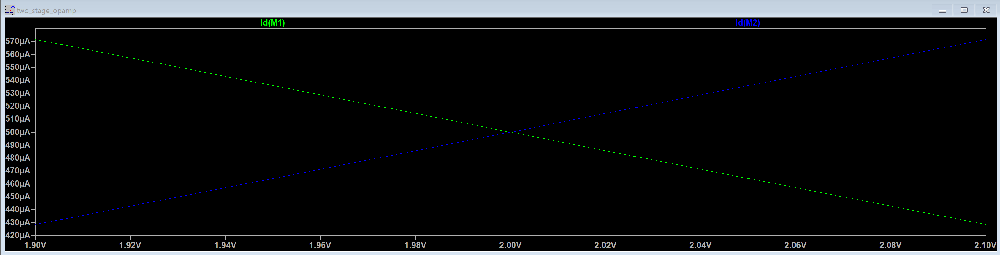

## Adding the PMOS current mirror

Then I added the PMOS current mirror. It basically mirrors the current from one side of the differential pair to the other side and also acts as an active load. This lets us get a single-ended output from the differential pair and gives more gain than using simple resistive loads.

At the operating point, I got as shown below:
Id(M1)= 0.5 mA
Id(M2)= 0.5 mA
|Id(M3)|= 0.5 mA
|Id(M4)|= 0.5 mA

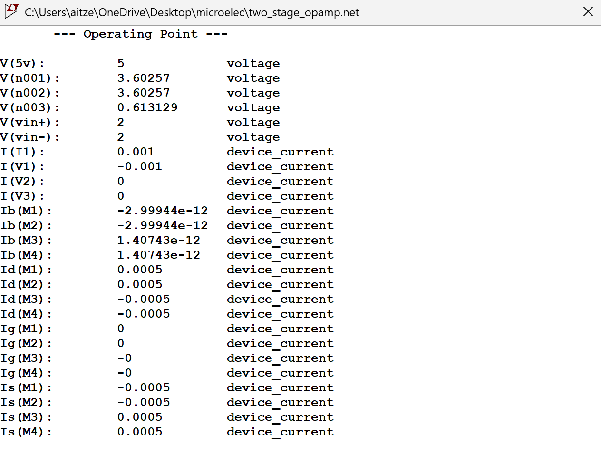

## First-stage amplifier is done

With these four transistors, we already have a one-stage amplifier.
I used the .tf analysis to calculate the gain of this first stage.
The result was : Gain = 75.7136 which is approximately 37.6 dB

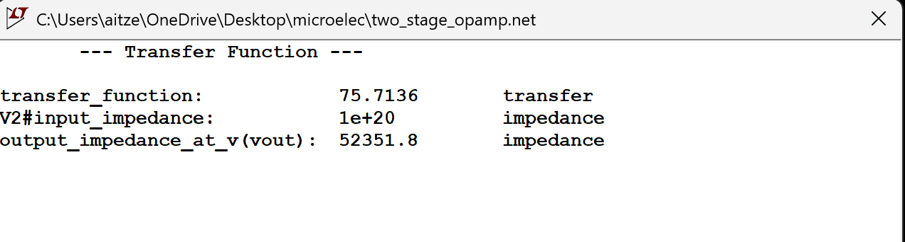

## Adding the second stage

Then I added the second stage using a common-source NMOS and a PMOS active load.

The common-source NMOS is used to add another voltage gain after the first stage, while the PMOS works as its active load. It seemed to me the best way to increase the gain without it being too complicated.

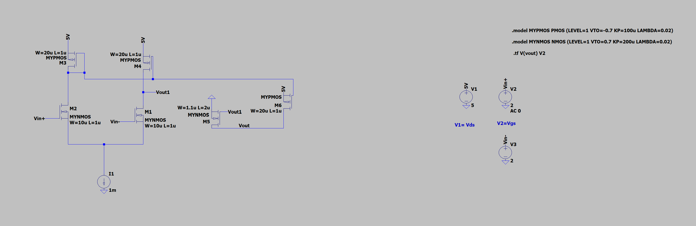

After adding the second stage, I first checked the operating point to make sure everything was working correctly.
the main valures are : 
Vout = 3.77327 V
Supply current = 1.49834 mA
VDD = 5 V

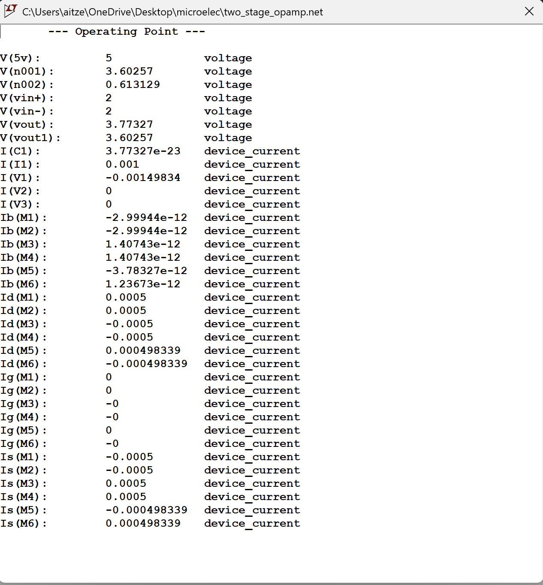

The power consumption is  approximately: P = 5V × 1.49834mA ≈ 7.49 mW which is apparently a bit high for a simple 2 stage op amp.

## Final gain
I then calculated the gain again using .tf :

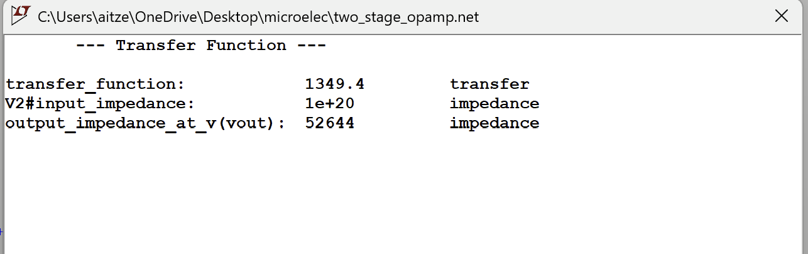

The final result was 1349.4 which is approximately 62.6 dB. i deem this a success.

## Frequency response

Now to test the bandwidth i added a 10pF capacitor and ran an AC analysis.

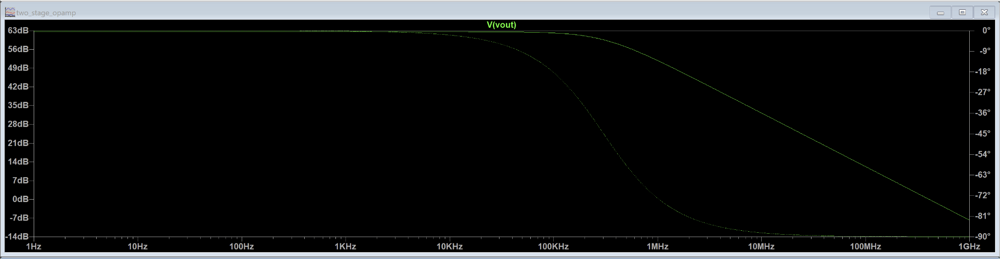

The low-frequency gain starts at around 62.6 dB, which matches the .tf result.

The approximate -3 dB bandwidth is 300 kHz.

then i proceeded with some tests with various inputs

## Small signal sine wave test

I tested the amplifier using a small sine wave around the DC bias point.
The goal here was simply to check that the amplifier behaved correctly in its linear region and that the output followed the input signal while amplifying it.

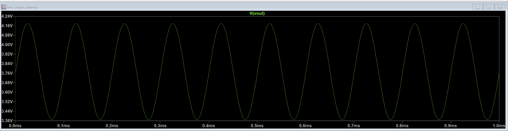

It works fine.

## Pulse / square-wave large signal test
Then I tested it using a pulse, or square-wave, input to see how quickly the output could react to a sudden change.

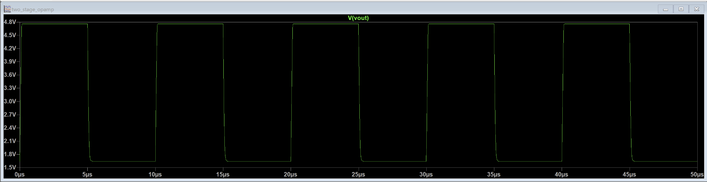

From this test, I measured:

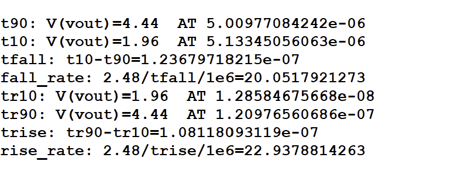

10–90% rise time=108 ns
90–10% fall time=124 ns
Rise rate=22.94 V/µs
Fall rate=20.05 V/µs

The rise and fall measurements are also consistent with the output voltage swing.

For the rising edge:22.94 V/µs × 0.108 µs ≈ 2.48 V
For the falling edge:  20.05 V/µs × 0.124 µs ≈ 2.49 V

## What I learned

This project taught me a lot and also taught me how to really visualize a transistor-level circuit. Instead of only seeing each transistor separately and learning what it does on its own, I got to see how the different parts interact with each other and how a complete amplifier can slowly be built from a few simpler transistor circuits.
Starting with just one NMOS, then adding the differential pair, the current mirror, and finally the second stage also made it much easier for me to understand why each part is there and what it actually does.

I also got more comfortable using LTspice for transistor characterization, operating-point analysis, DC sweeps, transfer-function analysis, AC analysis, and transient tests.
The Miller compensation is still something I need to understand better since I couldn't get it to work properly in this design.

